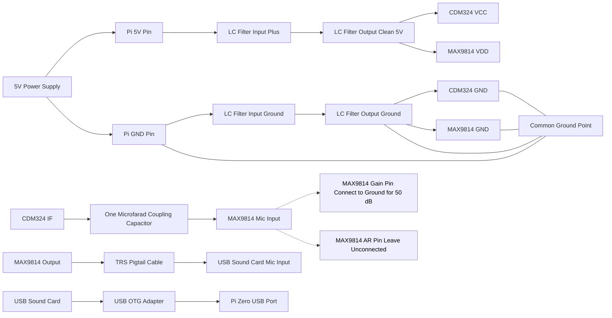
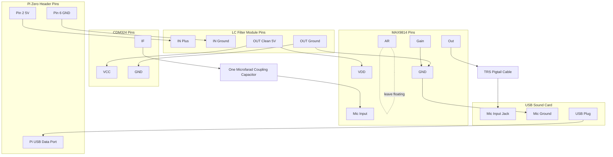

Gist:

Let's try to make something like a pocket radar using cheap parts.


```text
                  +-------------------------------------------+
                  |              Raspberry Pi Zero            |
                  |-------------------------------------------|
                  |                                           |
             5V --+-----------------------------+             |
            GND --+------------+                |             |
                  |            |                |             |
                  |            |                |             |
                  |        (via USB OTG)        |             |
                  |              |              |             |
                  |              v              |             |
                  |      +------------------+   |             |
                  |      | USB Audio Card   |   |             |
                  |      | (Movo / CM108)   |   |             |
                  |      |                  |   |             |
                  |      |   MIC IN  <------+---+-- MAX9814 OUT
                  |      |   GND     <------+------ Pi GND
                  |      +------------------+   |
                  +-------------------------------------------+

──────────────────────────────────────────────────────────────────
        CLEAN, FILTERED 5V SUPPLY (very important)
──────────────────────────────────────────────────────────────────

Pi 5V ----[ LC FILTER MODULE ]-------------------- Clean 5V output
                   | 
                   |  (Module has IN+, IN– → OUT+, OUT–)
                   |
                   +----> Clean 5V Rail for Radar + Preamp


──────────────────────────────────────────────────────────────────
                 CDM324 RADAR MODULE WIRING
──────────────────────────────────────────────────────────────────

                +------------------+
 Clean 5V  ---> |  VCC             |
 Pi GND    ---> |  GND             |
 CDM324 IF ---> |  IF   ---||----> (to MAX9814 MIC IN)
                +------------------+       1 µF X7R (AC coupling)


──────────────────────────────────────────────────────────────────
                  MAX9814 PREAMP WIRING
──────────────────────────────────────────────────────────────────

                 +-------------------------------+
 Clean 5V  ----> | VDD                           |
 Pi GND     ----> | GND                           |
 CDM324 IF (via 1µF) --> MIC IN                   |
 MAX9814 OUT -----> To USB Sound Card MIC IN      |
 GAIN pin --------> Tie to GND for **50 dB gain** |
 AR pin ----------> Leave unconnected (default)   |
                 +-------------------------------+


──────────────────────────────────────────────────────────────────
                       GROUNDING NOTES
──────────────────────────────────────────────────────────────────

ALL GROUNDS MUST CONNECT TOGETHER:

- Pi GND
- MAX9814 GND
- CDM324 GND
- USB Sound Card GND (this comes via USB)
- LC Filter output ground

Use a **star ground** if possible:
     one node where all grounds meet → minimizes noise / hum.


──────────────────────────────────────────────────────────────────
```




Pin Out

